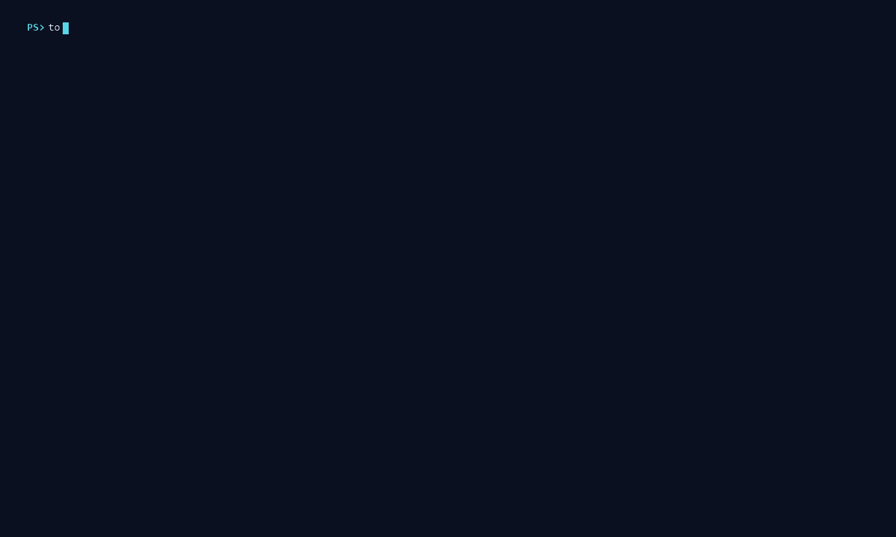

# Token Ledger

See how many tokens Claude Code and OpenAI Codex used each day—and estimate their public API-equivalent cost.



- **Local-first.** Session files stay on your machine; prompts, responses, credentials, and raw provider identifiers are not copied into the ledger.
- **Honest estimates.** Partial coverage, unknown prices, credits, and recorded cash remain separate instead of turning missing evidence into zero.
- **Auditable results.** Effective-dated pricing, exact source digests, stable schemas, and checksummed native releases make accounting decisions reproducible.

> Token Ledger is an unofficial community project and is not affiliated with OpenAI or Anthropic.

## Install

Download the latest archive for Windows x64, Linux x64, macOS Intel, or macOS Apple Silicon from [GitHub Releases](https://github.com/DiamondNit3/token-ledger/releases/latest). Verify it against `SHA256SUMS.txt`, extract it, and put `token-ledger` (or `token-ledger.exe`) on your `PATH`.

```text
token-ledger --version
token-ledger prices verify --plain
```

The macOS binaries are unsigned and not notarized. The Windows binary is also unsigned and may trigger SmartScreen.

To build from source, install Rust 1.88 or newer:

```text
git clone https://github.com/DiamondNit3/token-ledger.git
cd token-ledger
cargo install --path . --locked
```

No provider API key is required for local session accounting.

## Try it in 30 seconds

```text
token-ledger demo
token-ledger init --tz America/New_York
token-ledger today
token-ledger cost --month
```

`demo` uses deterministic synthetic data and does not read your configuration, database, or session files. Reporting commands refresh readable local sessions automatically; add `--no-scan` to query only the current ledger.

## Common commands

| Goal | Command |
|---|---|
| Preview synthetic data | `token-ledger demo` |
| Check setup and coverage | `token-ledger doctor` |
| Scan local sessions | `token-ledger scan` |
| Show today's usage | `token-ledger today` |
| Estimate this month's cost | `token-ledger cost --month` |
| Compare selected models | `token-ledger cost --all --model <MODEL>` |
| Export a date range | `token-ledger export --start <DATE> --end <DATE> --format json` |
| Inspect pricing evidence | `token-ledger prices status` |

Run `token-ledger --help` or `token-ledger <COMMAND> --help` for the complete CLI reference.

## Upgrading from v0.4.1

> [!CAUTION]
> Retain the original Claude Code and Codex session files and back up the v0.4.1 ledger before migrating. History cannot be rebuilt when its original source files have expired or been deleted.

Do this **before opening the database with the newer binary**. A newer release blocks all database commands until migration is authorized, including `export`. If you want a report export, create it with the old v0.4.1 executable. Report exports are archival views and cannot restore the local ledger.

For a restorable backup, stop every Token Ledger process and use SQLite's backup API (for example, `sqlite3 old.sqlite ".backup backup.sqlite"`). A raw file copy is safe only when the database is quiescent and the database, `-wal`, and `-shm` files are captured consistently together.

After backing up:

```text
token-ledger migrate --accept-history-loss
token-ledger scan --rebuild
```

Then re-import any reconciliation exports. Ordinary database commands fail closed until this migration is deliberately authorized. See the [privacy model](docs/PRIVACY.md) for why the barrier is necessary.

## What the numbers mean

Token Ledger reports provider-recorded token counters and calculates what matching usage would cost under the bundled public price catalog. That estimate is not an invoice: subscriptions, prepaid credits, taxes, discounts, and negotiated pricing may differ.

Unknown prices are never treated as `$0`. Reports distinguish exact, bounded, partial, and unpriced results, include catalog evidence, and mark incomplete scans as provisional. Provider reconciliation imports and user-recorded cash never overwrite locally observed usage.

The accounting rules and price evidence are reproducible; complete export bytes are not guaranteed to be byte-identical because reports include current scan and generation timestamps.

## Privacy and coverage

Token Ledger reads supported local Claude Code and Codex session files and stores only accounting metadata with deterministic pseudonymous identifiers. It does not store transcript bodies, credentials, raw source paths, or raw provider identifiers, and it makes no analytics or automatic network requests.

“All sessions” means all supported sessions still readable in the configured local roots. History may be incomplete when a client deletes old sessions, persistence was disabled, work occurred elsewhere, a source exceeds a safety bound, or a format changes. Every report exposes that uncertainty rather than claiming a false zero.

The scanner is resource-bounded and designed for trusted local session roots; it is not a security sandbox for directories controlled by a hostile process. Read the [privacy model](docs/PRIVACY.md) for the full threat model and retention policy.

## Documentation

- [Architecture](docs/ARCHITECTURE.md)
- [Privacy model](docs/PRIVACY.md)
- [Pricing model](docs/PRICING.md)
- [Dependency policy](docs/DEPENDENCIES.md)
- [Contributing](CONTRIBUTING.md)
- [Security policy](SECURITY.md)
- [Support](SUPPORT.md)
- [Changelog](CHANGELOG.md)
- [Release process](docs/RELEASING.md)
- [Public maintenance plan](docs/LAUNCH.md)

## Development

Run the complete local gate:

```powershell
powershell -NoProfile -ExecutionPolicy Bypass -File ./scripts/check.ps1
```

On POSIX systems, run `sh ./scripts/check.sh` for the portable code and package checks.

## License

Token Ledger is available under the [MIT License](LICENSE). OpenAI, ChatGPT, Codex, Anthropic, and Claude are trademarks or product names of their respective owners and are used only to describe compatibility.
